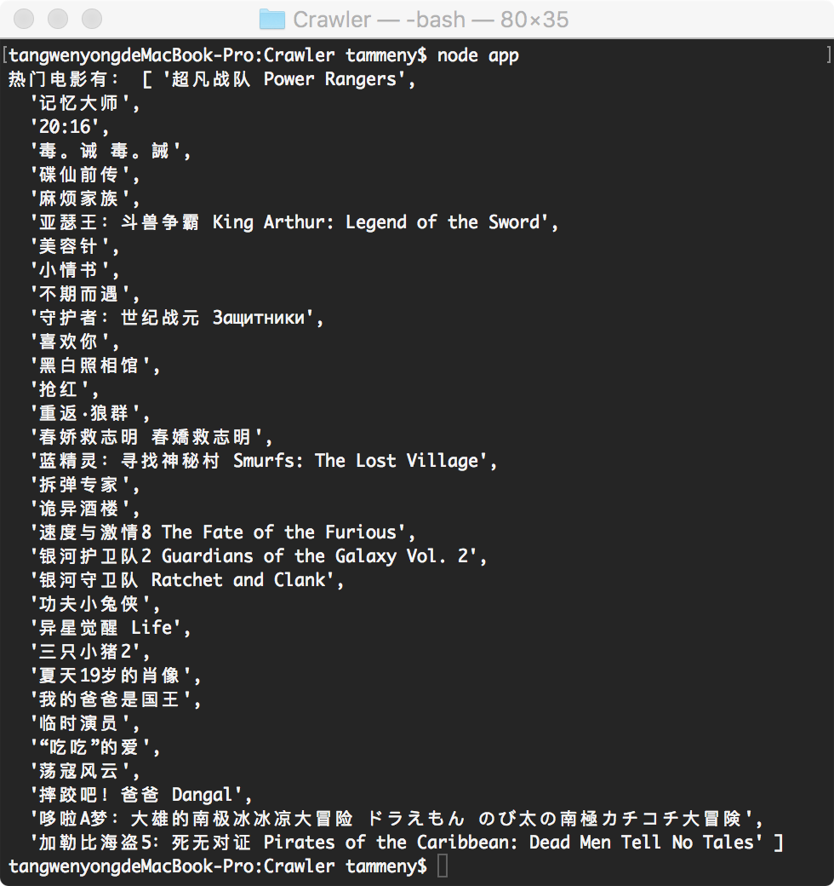

## 需求
抓取豆瓣网站下热门的电影。

## 依赖
- `request`：让http请求变得超级简单，同时支持https和重定向，用于发送请求获取网页内容；
- `cheerio`：是一个很好的解析库，服务端版本的jquery，用于查找网页内容。

## 原理
网络爬虫的实现原理很简单，其实就相当于我们浏览网页，本文的demo是通过nodejs的request模块发送http请求，加载目标网页，再通过cheerio查找想要的内容。

## 创建项目
```
npm init Crawler
npm install request --save
npm install cheerio --save
```
在项目根目录新建`index.js`并插入以下代码：
```
var request = require('request');
var cheerio = require('cheerio');
//获取热门电影
function getHotMovie(url){
	request(url, function(err, response, body) {
        if (!err && response.statusCode == 200) {
            $ = cheerio.load(body);
            var content = $(".ui-slide-content li.ui-slide-item");   //获取电影列表DOM
            var length = content.length;
            var list = [];
            while (length --) {
            	var title = $(content[length]).data("title");   //获取电影名称
                title && list.push(title);
            }
            console.info("热门电影有：", list);
        }else{
            console.info("网页加载失败：", err);
        }
    });
}
getHotMovie("https://movie.douban.com/");
```

## 开始抓取
运行``node index.js``开始抓取内容，最终获得以下结果：


## QA
1. 如何应对反爬虫策略？
如伪造浏览器header，使用代理ip，限制规定时间内请求次数等。
2. 如何读写excel？
    - `node-xlsx`: 基于Node.js解析excel文件数据及生成excel文件，仅支持xlsx格式文件；
    - `excel-parser`: 基于Node.js解析excel文件数据，支持xls及xlsx格式文件；
    - `excel-export`: 基于Node.js将数据生成导出excel文件，生成文件格式为xlsx；
    - `node-xlrd`: 基于node.js从excel文件中提取数据，仅支持xls格式文件；
    - `js-xlsx`: 是目前Github上star数量最多的处理Excel的库，功能强大，但上手难度稍大。
3. 如何抓取分页数据？
分析前几页链接的变化规律，通常url后面会有个数字递增，这就是页码了。